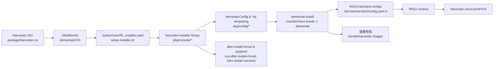

# PROJECT_ANALYSIS

## A. 项目概览
- **定位**：`harvester-installer` 提供交互式/自动化安装 UI 与配置生成，驱动底层 Elemental/cOS 安装，并在落盘前准备 RKE2/Harvester 所需配置与镜像；它不直接打包 Harvester 源码，而是消费预先准备好的 bundle 与模板。[F:main.go†L16-L82][F:pkg/console/util.go†L518-L629]
- **与 ISO/RootFS/OS、RKE2/Rancher/Harvester-API 关系（Mermaid）**

- **主要构建产物与落点**
  - `harvester-installer` 二进制，运行于安装环境 TTY，通过系统d drop-in 绑定到 getty。[F:main.go†L16-L82][F:package/harvester-os/files/usr/bin/setup-installer.sh†L1-L82]
  - ISO 内置文件：内核/ initrd、`rootfs.squashfs`、`bundle/harvester` 镜像/镜像列表、Elemental manifest、grub 配置（`package/harvester-os/iso` 构建）。落地 `/run/initramfs/live` 挂载。[F:scripts/package-harvester-os†L33-L162][F:package/harvester-os/files/usr/sbin/harv-install†L3-L167]
  - 安装脚本：`/usr/sbin/harv-install`（调用 elemental、镜像预热、保存配置），`/usr/sbin/cos-installer-shutdown` 负责完成后重启。[F:pkg/console/util.go†L518-L629][F:package/harvester-os/files/usr/sbin/harv-install†L169-L520]
  - 系统服务与 OEM yip：`system/oem/*.yaml` 控制引导时网络、kdump、installer 启动。[F:package/harvester-os/files/system/oem/91_installer.yaml†L1-L11][F:package/harvester-os/files/system/oem/90_network.yaml†L1-L8]
  - RKE2/Harvester 配置模板：`pkg/config/templates/*.yaml` 渲染到 `/etc/rancher/rke2/config.yaml.d` 和 `/etc/rancher/rancherd/config.yaml.d`。[F:pkg/config/cos.go†L320-L460]

## B. 代码结构与关键模块
- **关键目录**
  - `pkg/console`: 交互式 UI、安装流程控制、网络配置应用。
  - `pkg/config`: 配置结构、模板渲染、Elemental/cOS 转换。
  - `pkg/preflight`: 安装前硬件/网络检查。
  - `package/harvester-os/files`: 进入 ISO 的脚本、systemd 单元、yip 阶段。
  - `scripts`: 构建与打包 ISO/镜像的流水线。
- **模块职责**
  - `pkg/console/console.go`: 初始化日志、选择 dashboard、运行 preflight、主循环。[F:pkg/console/console.go†L16-L198]
  - `pkg/console/install_panels.go`: UI 面板定义，自动安装入口，合并远端配置，网络/VIP/DNS 验证，触发 `doInstall`。[F:pkg/console/install_panels.go†L2566-L2717]
  - `pkg/console/util.go`: 安装执行核心——生成 env 与 Elemental 配置、磁盘布局、镜像写入、调用 `/usr/sbin/harv-install` 和关机脚本。[F:pkg/console/util.go†L518-L629]
  - `pkg/config/config.go`: 配置 schema、默认值、Kubelet 计算、系统设置白名单。[F:pkg/config/config.go†L1-L208][F:pkg/config/config.go†L520-L604]
  - `pkg/config/read.go`: 从 kernel cmdline `harvester.*` 和 `/oem/userdata.yaml` 读取配置，支持 env 展开。[F:pkg/config/read.go†L18-L92]
  - `pkg/config/cos.go`: 将 HarvesterConfig 转成 Elemental config 与 yip stages（rootfs/initramfs/network/after-install），生成 RKE2/Harvester 模板文件。[F:pkg/config/cos.go†L62-L239][F:pkg/config/cos.go†L320-L460]
  - `package/harvester-os/files/usr/sbin/harv-install`: 实际落盘脚本；挂载激活分区、可选下载 ISO、预热镜像、调用 elemental、写 grub/配置/日志、数据盘格式化。[F:package/harvester-os/files/usr/sbin/harv-install†L3-L520]
  - `package/harvester-os/files/usr/bin/setup-installer.sh`: 设置 systemd drop-in 用 installer 替换 getty，加载环境变量。[F:package/harvester-os/files/usr/bin/setup-installer.sh†L1-L82]
  - `scripts/package-harvester-os`: 构建 Harvester OS 镜像、打包 bundle、生成 ISO/pxe 文件、嵌入版本信息。[F:scripts/package-harvester-os†L33-L195]
- **配置来源与优先级**
  1. 内核参数 `harvester.*` 解析为 config（优先最高）。[F:pkg/config/read.go†L18-L29]
  2. `/oem/userdata.yaml`（cloud-init 风格）合并。[F:pkg/config/read.go†L54-L92]
  3. 运行时远端 `install.configUrl`（PXE/自动化）再 merge。[F:pkg/console/install_panels.go†L2576-L2706]
  4. 模板默认值：版本、存储类、Longhorn 参数等在渲染前填充。[F:pkg/config/cos.go†L271-L318]
- **日志与可观测性**
  - 默认日志 `/var/log/console.log`，可通过 env `DEBUG=true` 打开 debug level，`LOGFILE` 重定向路径。[F:pkg/console/console.go†L16-L43]
  - 安装失败后提示查看日志，并在 debug 模式收集 supportconfig。[F:pkg/console/util.go†L593-L605]
  - 安装环境 console（tty1）实时输出，`harv-install` 过程中也会打印镜像加载/分区状态。[F:package/harvester-os/files/usr/sbin/harv-install†L169-L520]

## C. 安装流程真实执行顺序
- **阶段划分**
  1. **引导阶段**：GRUB -> initrd，Elemental/cOS 运行 yip `initramfs` 阶段。
  2. **Installer 启动**：`system/oem/91_installer.yaml` 调用 `setup-installer.sh` 生成 systemd drop-in，`start-installer.sh` 在 tty 上运行 `harvester-installer`。
  3. **交互/自动化收集配置**：UI 面板 & preflight，可能下载 configUrl。
  4. **生成配置并执行安装**：转换 HarvesterConfig -> Elemental config & yip，调用 `/usr/sbin/harv-install`。
  5. **落盘/镜像预热**：elemental 分区、写入 rootfs/oem/persistent，预热 RKE2/Rancherd/Harvester 镜像。
  6. **收尾/重启**：保存配置、写 grub 参数、cos-installer-shutdown 触发 reboot。
  7. **首次启动**：已安装系统 boot，yip `boot/network` 阶段应用持久配置，RKE2 & Harvester chart 启动。
- **阶段-动作-入口表**

| 阶段 | 动作 | 代码入口 |
| --- | --- | --- |
| 引导 | 挂载 live 根、启用网络模块 | Elemental 默认 + `system/oem/90_network.yaml` bring-up。[F:package/harvester-os/files/system/oem/90_network.yaml†L1-L8] |
| Installer 启动 | 创建 getty drop-in，加载 `/etc/rancher/installer/env` 后执行 installer | `system/oem/91_installer.yaml` 调用 `setup-installer.sh`；drop-in 运行 `start-installer.sh` -> `harvester-installer`。[F:package/harvester-os/files/system/oem/91_installer.yaml†L1-L11][F:package/harvester-os/files/usr/bin/setup-installer.sh†L1-L82][F:package/harvester-os/files/usr/bin/start-installer.sh†L1-L15] |
| 配置收集 | 读取 kernel 参数 & userdata，UI 校验、预检、网络/VIP 处理，merge 远端 configUrl | `ReadConfig()` 解析 cmdline；`layoutInstall`/`addInstallPanel` 处理自动化逻辑与校验。[F:pkg/config/read.go†L18-L92][F:pkg/console/install_panels.go†L2566-L2717] |
| 配置生成 | 将 HarvesterConfig 渲染为 Elemental/Yip & RKE2 配置 | `generateEnvAndConfig` -> `ConvertToElementalConfig/ConvertToCOS` -> `initRancherdStage` 写 RKE2/rancherd 文件。[F:pkg/config/cos.go†L102-L239][F:pkg/config/cos.go†L320-L460] |
| 执行安装 | 调用 `/usr/sbin/harv-install`，可选擦盘/分区、镜像预热、elemental install、保存配置、修改 grub | `doInstall()` 调用 `harv-install`；脚本处理下载 ISO、挂载、镜像导入、数据盘格式化、grub 调整、保存配置与日志。[F:pkg/console/util.go†L518-L629][F:package/harvester-os/files/usr/sbin/harv-install†L169-L520] |
| 重启 | 执行 `cos-installer-shutdown` 关闭/重启 | `doInstall` 末尾绑定 Ctrl+C 取消自动重启，调用关机脚本。[F:pkg/console/util.go†L609-L629] |
| 首次启动 | 持久化网络、RKE2 配置、kdump、模块加载、CA、rke2-shutdown service 启用 | OEM yip `99_*` & `91_rke2-shutdown`; 网络配置复制到 `/etc/NetworkManager/system-connections`。[F:pkg/config/cos.go†L188-L237][F:package/harvester-os/files/system/oem/99_cni_reset.yaml†L1-L5][F:package/harvester-os/files/system/oem/99_modules.yaml†L1-L6][F:package/harvester-os/files/system/oem/91_rke2-shutdown.yaml†L1-L7][F:pkg/config/cos.go†L210-L217] |
- **失败/回滚**
  - `harv-install` 有 `cleanup` trap 卸载/删除临时资源；失败时不会自动回滚分区，仅打印错误并返回，需人工重新执行。[F:package/harvester-os/files/usr/sbin/harv-install†L65-L79]
  - UI 层检测错误会阻断安装；debug 模式收集 supportconfig 便于排查。[F:pkg/console/install_panels.go†L2647-L2717][F:pkg/console/util.go†L593-L605]

## D. 依赖与制品（离线）
- **镜像/二进制/包**
  - RKE2、Rancher、Harvester chart 镜像及镜像列表随 ISO 的 `bundle/harvester`、`bundle/rancherd` 打包。[F:scripts/package-harvester-os†L33-L162]
  - `harvester-cluster-repo` 镜像及镜像列表用于 net-install。[F:scripts/package-harvester-os†L162-L195]
  - Elemental CLI 从 OS 镜像提取到主机 `/usr/bin/elemental` 参与构建。[F:scripts/package-harvester-os†L139-L162]
- **镜像列表来源与加载**
  - 镜像列表位于 `bundle/harvester/images/*.tar.zst` 与 `images-lists/*.txt`；`harv-install` 在安装时 bind/rsync 到目标并用 `ctr` 导入，使用 `ctr-check-images.sh` 校验。[F:package/harvester-os/files/usr/sbin/harv-install†L178-L318]
- **离线校验/打包**
  - 构建时 `collect-deps.sh` 写入 `harvester-release.yaml`，并保留 SHA256（构建后再生成）；未见签名逻辑，需外部加固。[F:scripts/package-harvester-os†L33-L87]
- **复现完整构建**
  - 依赖 Docker/Go/Helm，主命令 `make` 触发 dapper -> `scripts/build` 目录流程，关键是 `scripts/package-harvester-os` 生成 ISO；可通过 `ARCH`/`USE_LOCAL_IMAGES` 等环境变量切换。[F:Makefile†L1-L17][F:scripts/package-harvester-os†L33-L195]

## E. 可扩展点与风险
- **官方/低侵入扩展**
  - kernel cmdline & `/oem/userdata.yaml` 注入额外写文件、模块、sysctl、afterInstallChroot 命令（通过 HarvesterConfig.OS）。[F:pkg/config/config.go†L200-L239][F:pkg/config/cos.go†L131-L239]
  - RKE2/Harvester chart 值、Webhooks、Addons 在 config schema 中暴露，可通过 configUrl 自动化。[F:pkg/config/config.go†L90-L205][F:pkg/config/config.go†L520-L604]
  - `after-install-chroot` 阶段允许追加命令/文件，适合安装后首次启动前植入服务。[F:pkg/config/cos.go†L227-L237][F:pkg/config/config.go†L200-L239]
  - `harv-install` 预留 `HARVESTER_ADDITIONAL_KERNEL_ARGUMENTS` 环境变量注入 grub。[F:package/harvester-os/files/usr/sbin/harv-install†L286-L320]
- **硬改/高风险**
  - 修改 `harv-install`、`setup-installer.sh` 或 yip OEM 文件会影响启动/安装路径，升级时需重基线对比。
  - 直接改模板 (`pkg/config/templates`) 会影响 RKE2/Harvester 行为，升级合并冲突概率高。
  - 替换 bundle 镜像/镜像列表需同步 `metadata.yaml`，否则预热/校验失败。
- **升级敏感文件/接口**
  - `/usr/sbin/harv-install`、`pkg/config/templates/*`、`package/harvester-os/files/system/oem/*.yaml`、`pkg/config/cos.go` 渲染逻辑、`pkg/console/install_panels.go` 流程控制。

## 建议的阅读 Top 10
1. `pkg/console/install_panels.go` – 交互与自动化逻辑。
2. `pkg/console/util.go` – 安装执行、调用脚本。
3. `pkg/config/cos.go` – Elemental/yip 渲染。
4. `pkg/config/config.go` – 配置 schema 与默认。
5. `pkg/config/templates/*` – RKE2/Harvester 配置模板。
6. `package/harvester-os/files/usr/sbin/harv-install` – 落盘与镜像处理。
7. `package/harvester-os/files/system/oem/91_installer.yaml` – installer 启动入口。
8. `package/harvester-os/files/usr/bin/setup-installer.sh` – systemd drop-in。
9. `scripts/package-harvester-os` – 构建/打包流水线。
10. `README.md` – 构建、调试、自动安装概览。

## 调试/插桩建议
- 打开安装日志：`DEBUG=true LOGFILE=/tmp/installer.log harvester-installer`；或在 tty1 直接观察。
- 在 `pkg/console/install_panels.go` 关键校验处增加 `logrus.Debugf`；编译后用 `vagrant rsync` 同步测试（README 提供）。
- 在 `harv-install` 中插入 `set -x` 或 `tee` 输出到 `/run/log`，注意恢复 `cleanup`。
- 使用 config 的 `OS.AfterInstallChrootCommands` 写入自定义 systemd 服务，便于安装后自动拉起调试守护。
- 通过 `HARVESTER_DASHBOARD=true` 环境变量复现已安装状态的 dashboard，检查 RKE2 配置生效情况。[F:pkg/console/console.go†L143-L188]
